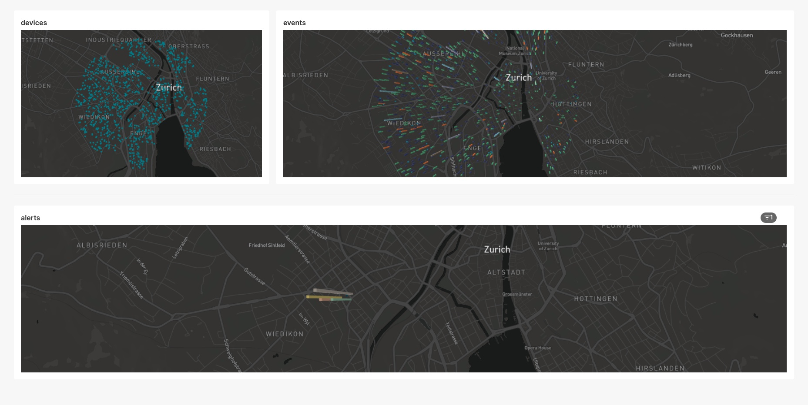
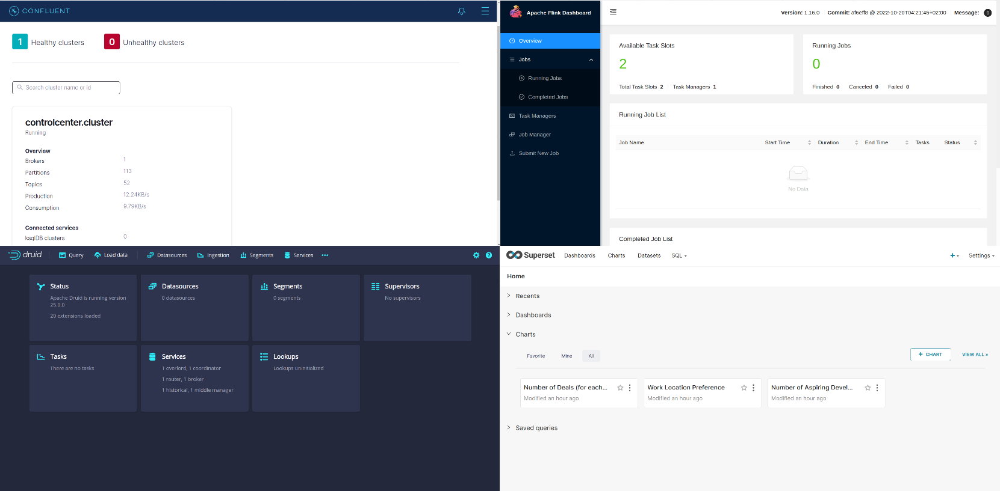
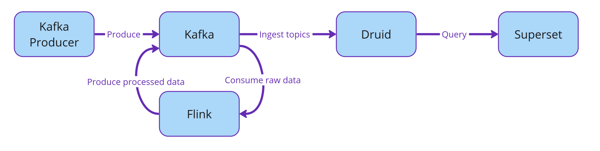

<br>

[![Button Acosom]][LinkAcosom] [![Button Twitter]][LinkTwitter] [![Button Linkedin]][LinkLinkedin]

<br>

## :bulb: Introduction

In this new blog post (or github repo), we show you a use case we had to solve for a customer, in the IoT business.

The end-product is a dashboard with live, streaming analytics. It looks like the below.



We will be using the following technologies:

1. [Apache Kafka](https://kafka.apache.org/)
2. [Apache Flink](https://flink.apache.org/)
3. [Apache Druid](https://druid.apache.org/)
4. [Apache Superset](https://superset.apache.org/)

We will be using Apache Kafka as our central data system with which all other services will interact to either consume (read) or produce (write) data. Druid will be our database to ingest and persist our Kafka topics and analytics, and Superset will be our BI tool to produce real-time dashboards querying against Druid. Flink will also join the fun as our stream-processing engine and will be given two jobs:

1. Real-time join between 2 Kafka topics, serving as a topic-enrichment job.
2. Alerting system, monitoring events, aggregating over time-windows and producing alerts to Kafka

Notice that we are using only [Apache](https://www.apache.org/) technologies so far; that is because we root for the open-source community :hugs:.

This solution builds up on all our previous blog posts, that you can find here:

1. [Kafka 101 Tutorial - Getting Started with Confluent Kafka](https://acosom.com/en/blog/kafka-101-getting-started-with-confluent-kafka/)
2. [Kafka 101 Tutorial - Streaming Analytics with Apache Flink](https://acosom.com/en/blog/kafka-101-tutorial-streaming-analytics-with-apache-flink/)
3. [Kafka 101 Tutorial - Real-Time Dashboarding with Druid and Superset](https://acosom.com/en/blog/kafka-101-tutorial-real-time-dashboarding-with-druid-and-superset/)

## :whale2: Requirements

To get this project running, you will just need minimal requirements: having [Docker](https://www.docker.com/) and [Docker Compose](https://docs.docker.com/compose/) installed on your computer.

To get this project running, you will need the following:

1. [Docker](https://www.docker.com/)
2. [Docker Compose](https://docs.docker.com/compose/) to orchestrate the infrastructure.
3. [Miniconda](https://docs.conda.io/en/latest/miniconda.html) to create a Python virtual environment and run the Python scripts.
4. [A Mapbox API key](https://www.mapbox.com/) to have map data inside Superset. For that, you simply need to create a free account with Mapbox which will give you a free API key with more than enough credits.

The versions I used to build the project are

```bash
## Docker
docker --version
> Docker version 24.0.2, build cb74dfcd85

## Docker Compose
docker-compose --version
> Docker Compose version 2.18.1

## Conda
conda --version
> conda 22.11.1

## Python
python --version
> Python 3.11.3
```

If your versions are different, it should not be a big problem. Though, some of the following might raise warnings or errors that you should debug on your own.

## :snake: Python Virtual Environment

To have all the python dependencies required to run the Kafka producers and other Python scripts inside this project, I would recommend setting up a virtual environment with Miniconda.

To do that, make sure you have Miniconda installed on your computer, which should give you the shell command `conda`.

From inside the project, type the following commands

```bash
## Create env
conda create -n <env-name> python=3.11

## Activate the env
conda activate <env-name>

## Install Python libraries
pip install -r requirements.txt
```

With this, you are good to go! Remember to always activate the virtual environment when you run Python scripts from this project.

## :factory: Infrastructure

To have everything up and running, you will simply need to run the `start.sh` script, that will start the whole infrastructure for you.

```bash
## Clone the repo
git clone https://github.com/theodorecurtil/iot_streaming_analytics.git

## cd into the repo
cd iot_streaming_analytics

## start the infrastructure
./start.sh
```

> :warning: You might have to make the `start.sh` script executable before being allowed to execute it. If this happens, simply type the following command

```bash
chmod +x start.sh
```

The Druid docker-compose file requires the name of the Docker network to run on. You will be prompted during the run of the `start` script. If you did not change the name of the default Docker network, then it should be `<name-of-project-directoy>_default`, so you can simply hit Enter when prompted for the name of the network. Otherwise, you can also type in the name of the Docker network you wish to connect to.

The `start` script will also prompt you for your Mapbox API key, so have it ready. In case you do not want to make the account with Mapbox, you can just type in a random string or nothing at all. Script execution and everything else will work, you just won't have map data in the Superset dashboard.

At some point, the `start` script will prompt you to clean and reset the Druid database, and then to start the Python producers. Before continuing with the script execution, perform the sanity check below.

### :medical_symbol: Sanity Check

To check that all the services are up and running (you will see that a lot of Docker containers are running by now), visit the following urls and check that all the UIs load properly:

1. Kafka: [http://localhost:9021](http://localhost:9021/clusters)
2. Flink: [http://localhost:18081](http://localhost:18081/#/overview)
3. Druid: username is `druid_system` and password is `password2` [http://localhost:8888](http://localhost:8888)
4. Superset: username is `admin` and password is `admin` [http://localhost:8088](http://localhost:8088)

You should see something like



The relationship between all the services is illustrated with the flow diagram below.



In the following sections, we will see how to setup the stream ingestion by Apache Druid from our Kafka cluster; and then how to link Druid to Superset to create real-time dashboards!

## :cyclone: Druid Stream Ingestion

The Kafka producer we started produces messages in the `SALES` topic. These are fake sales events produced every second with the following schema

```json
{
    "type": "record",
    "name": "StoreSale",
    "namespace": "com.acosom",
    "fields": [
        {
            "name": "store_id",
            "type": {
                "type": "string",
                "avro.java.string": "String"
            },
            "doc": "ID of the store where the sale was made."
        },
        {
            "name": "sale_amount",
            "type": "int",
            "doc": "Amount of the sale in local currency. This value is an integer."
        },
        {
            "name": "sale_ts",
            "type": "long",
            "doc": "Epoch timestamp when the sale happened."
        }
    ]
}
```

First thing we will do is connect Druid to our Kafka cluster to allow the streaming ingestion of this topic and store it in our real-time database.

We will do this using Druid's UI at [http://localhost:8888](http://localhost:8888). Below we show how to create the streaming ingestion spec step-by-step, but note that the ingestion spec can simply be posted using Druid's rest API as a json.

### Design the Stream Ingestion Spec

The first step is to click the `Load data` button and select the `Streaming` option.


Then select `Start a new streaming spec` to start writing our custom streaming spec.


Once this is done, select `Apache Kafka` as the source.


Once this is done, write the address of the Kafka broker and the topic name and click to apply the configuration. You should then see on the left sample data points from our `SALES` topic. Note that the data is not deserialized as this is the raw data coming from Kafka. We will need to include the Avro deserializer. To do this, click the `Edit spec` button.


In the spec config, add the following (thank you [Hellmar](https://blog.hellmar-becker.de/2021/10/19/reading-avro-streams-from-confluent-cloud-into-druid/)):

```json
"inputFormat": {
"type": "avro_stream",
"binaryAsString": false,
"avroBytesDecoder": {
    "type": "schema_registry",
    "url": "http://schema-registry:8081"
    }
}
```

and then click the `Parse data` button to go back to editing the spec.


Now you should see our data being properly deserialized! Click the `Parse time` button to continue.


From now on, there is not much more to edit, simply click through the panels until the streaming spec is submitted. Druid's UI will then automatically redirect to the `Ingestion` tab where you should see the following, indicating that Druid is successfully consuming from Kafka.


Finally, to check that data is properly loaded in Druid, click the `Query` tab and try a mock query. See example below.


:tada: The stream ingestion is setup and now Druid will keep listening to the `SALES` Kafka topic.

## :framed_picture: Data Visualization in Superset

Now that the data in successfully being ingested in our streaming database, it is time to create our dashboard to report sales to management!

Navigate to the Superset UI at [localhost:8088](http://localhost:8088).

First thing we need to do is to connect our Druid database to Superset. To do this, click the `+` button in the upper-right corner and select `Data` and `Connect database`. Then, follow the steps shown below. Note that the connection string contains the following:

1. database type: `druid`
2. database credentials: `druid_system` and `password2`
3. database sql endpoint: `172.18.0.1:8888/druid/v2/sql`

Because Superset is not running on the same Docker network as the other services, we have to access it using the host. This will change depending on your OS. See [Superset documentation](https://superset.apache.org/docs/installation/installing-superset-using-docker-compose/#5-connecting-superset-to-your-local-database-instance).

Basically, the following should apply:

1. `host.docker.internal` for Mac or Ubuntu users
2. `172.18.0.1` for Linux users


### Create Dashboard

In Superset, a `Dashboard` is made of `Charts`; so the first thing is to create a `Chart`. To create a `Chart` we need to create a `Dataset` object. Click the `Dataset` button and follow the steps below to create a `Dataset` from the `SALES` topic.


Create a time-series area chart from the `SALES` dataset and add a couple of configurations to the chart, as shown below. Then save the `Chart` and add it to a new `Dashboard`.


## :chipmunk: Throw in some Apache Flink

You will note that the Superset `Chart` that we created does the 1-Minute aggregation that our Flink job also does. Let us directly consume the aggregated data from Apache Flink now, and see if both aggregations report the same figures.

The steps to follow:

1. Start the Flink job
2. Write the streaming ingestion spec into Druid from the new topic
3. Create new chart in Superset and add it to the dashboard

### Start the Flink job

To start the aggregating Flink job that computes aggregated sales per store per window of 1 minute, type the following commands:

```bash
## Docker exec in the container
docker exec -it sql-client bash

## Start the Flink job
sql-client.sh -f sales-aggregate.sql

## Exit container
exit
```

You will see in Kafka that a new topic `SALES_AGGREGATE` is created by the Flink job.

Now repeat the operations related to Druid and Superset to ingest the data in Druid and create the `Chart` in Superset.

See the dashboard below


As expected, the two charts are identical, as the same aggregation is performed; but in one case the aggregation in performed in Superset, and in the other case it is performed via Apache Flink, and Superset simply reads the data from the database without having to perform any work. In addition we created a pie-chart that shows the share of each store in the total amount of sales. As expected, this is close to a uniform distribution of the sales as each store generates sales from the same uniform distribution.

## :skull_and_crossbones: Tear the Infrastructure Down

When you are done playing with the project, follow the step below to stop the whole infrastructure.

```bash
## In the iot_streaming_analytics directory
./stop.sh
```

Again, make sure that the `stop.sh` script in the `iot_streaming_analytics` folder is executable.

## :pushpin: Conclusion

In this blog post, we demonstrated the solution we implemented for a customer, to perform streaming analytics and produce real-time insights using Kafka, Flink, Druid and Superset.

In case you have any questions or wish to know more about our services, you can visit us at [acosom.com](https://acosom.com/en?utm_source=github&utm_medium=social&utm_campaign=repo-iot-streaming-analytics).

<!---------------------------------------------------------------------------->

[Button Acosom]: https://img.shields.io/badge/Acosom-Read%20blog%20post-orange
[Button Twitter]: https://img.shields.io/twitter/follow/theodore_curtil?style=social
[Button Linkedin]: https://img.shields.io/badge/LinkedIn-Follow%20Acosom-blue

[LinkAcosom]: https://acosom.com/en/blog/kafka-101-tutorial-real-time-dashboarding-with-druid-and-superset/?utm_source=github&utm_medium=social&utm_campaign=blog 'Read on acosom.com'
[LinkTwitter]: https://twitter.com/theodore_curtil 'Follow me on Twitter :)'
[LinkLinkedin]: https://ch.linkedin.com/company/acosom 'Follow us on LinkedIn :)'