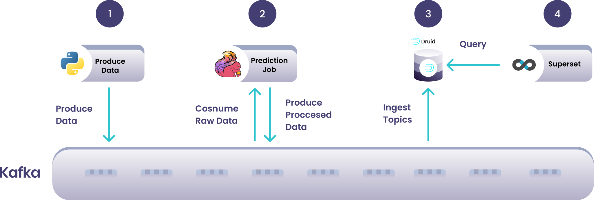

<br>

[![Button Acosom]][LinkAcosom] [![Button Twitter]][LinkTwitter] [![Button Linkedin]][LinkLinkedin]

<br>

## :bulb: Introduction

In this new blog post (or github repo), we present a case study concerning one of our customer in the domain of Internet of Things (IoT). In this specific use-case, we want to build a dashboard to quickly identify which devices have a behaviour deviating from the measured norm. For instance, it could be connected doors located in a city, with an area having a network disruption causing all doors to reject access to users in this area. With streaming analytics, we can identify those events as they arrive and notify users or support about the disruption of service.

The end-product is a dashboard with live, streaming analytics. It appears as below.


We will be using the following technologies:

1. [Apache Kafka](https://kafka.apache.org/)
2. [Apache Flink](https://flink.apache.org/)
3. [Apache Druid](https://druid.apache.org/)
4. [Apache Superset](https://superset.apache.org/)

The architecture with Apache Kafka acting as central nervous system is described below.



We will be using Apache Kafka as our central data system with which all other services will interact to either consume (read) or produce (write) data. Druid will be our database to ingest and persist our Kafka topics and analytics, and Superset will be our BI tool to produce real-time dashboards querying against Druid. Flink will also join the fun as our stream-processing engine and will be given two jobs:

1. Real-time join between 2 Kafka topics, serving as a topic-enrichment job.
2. Alerting system, monitoring events, aggregating over time-windows and producing alerts to Kafka

Notice that we are using only [Apache](https://www.apache.org/) technologies so far; that is because we root for the open-source community :hugs:.

This solution builds up on all our previous blog posts, that you can find here:

1. [Kafka 101 Tutorial - Getting Started with Confluent Kafka](https://acosom.com/en/blog/kafka-101-getting-started-with-confluent-kafka/)
2. [Kafka 101 Tutorial - Streaming Analytics with Apache Flink](https://acosom.com/en/blog/kafka-101-tutorial-streaming-analytics-with-apache-flink/)
3. [Kafka 101 Tutorial - Real-Time Dashboarding with Druid and Superset](https://acosom.com/en/blog/kafka-101-tutorial-real-time-dashboarding-with-druid-and-superset/)

## :whale2: Requirements

To get this project running, you will just need minimal requirements: having [Docker](https://www.docker.com/) and [Docker Compose](https://docs.docker.com/compose/) installed on your computer.

To get this project running, you will need the following:

1. [Docker](https://www.docker.com/)
2. [Docker Compose](https://docs.docker.com/compose/) to orchestrate the infrastructure.
3. [Miniconda](https://docs.conda.io/en/latest/miniconda.html) to create a Python virtual environment and run the Python scripts.
4. [A Mapbox API key](https://www.mapbox.com/) to have map data inside Superset. For that, you simply need to create a free account with Mapbox which will give you a free API key with more than enough credits.

The versions I used to build the project are

```bash
## Docker
docker --version
> Docker version 24.0.2, build cb74dfcd85

## Docker Compose
docker-compose --version
> Docker Compose version 2.18.1

## Conda
conda --version
> conda 22.11.1

## Python
python --version
> Python 3.11.3
```

If your versions are different, it should not be a big problem. Though, some of the following might raise warnings or errors that you should debug on your own.

## :snake: Python Virtual Environment

To have all the python dependencies required to run the Kafka producers and other Python scripts inside this project, I would recommend setting up a virtual environment with Miniconda.

To do that, make sure you have Miniconda installed on your computer, which should give you the shell command `conda`.

From inside the project, type the following commands

```bash
## Create env
conda create -n <env-name> python=3.11

## Activate the env
conda activate <env-name>

## Install Python libraries
pip install -r requirements.txt
```

With this, you are good to go! Remember to always activate the virtual environment when you run Python scripts from this project.

## :factory: Infrastructure

To have everything up and running, you will simply need to run the `start.sh` script, that will start the whole infrastructure for you.

```bash
## Clone the repo
git clone https://github.com/theodorecurtil/iot_streaming_analytics.git

## cd into the repo
cd iot_streaming_analytics

## start the infrastructure
./start.sh
```

> :warning: You might have to make the `start.sh` script executable before being allowed to execute it. If this happens, simply type the following command

```bash
chmod +x start.sh
```

The Druid docker-compose file requires the name of the Docker network to run on. You will be prompted during the run of the `start` script. If you did not change the name of the default Docker network, then it should be `<name-of-project-directoy>_default`, so you can simply hit Enter when prompted for the name of the network. Otherwise, you can also type in the name of the Docker network you wish to connect to.

The `start` script will also prompt you for your Mapbox API key, so have it ready. In case you do not want to make the account with Mapbox, you can just type in a random string or nothing at all. Script execution and everything else will work, you just won't have map data in the Superset dashboard.

At some point, the `start` script will prompt you to clean and reset the Druid database, and then to start the Python producers. Before continuing with the script execution, perform the sanity check below.

### :medical_symbol: Sanity Check

To check that all the services are up and running (you will see that a lot of Docker containers are running by now), visit the following urls and check that all the UIs load properly:

1. Kafka: [http://localhost:9021](http://localhost:9021/clusters)
2. Flink: [http://localhost:18081](http://localhost:18081/#/overview)
3. Druid: username is `druid_system` and password is `password2` [http://localhost:8888](http://localhost:8888)
4. Superset: username is `admin` and password is `admin` [http://localhost:8088](http://localhost:8088)

You should see something like


### :framed_picture: Upload Superset Dashboard

In Superset, upload the dashboard located in `./superset_dashboard/IOT-STREAMING-ANALYTICS.zip` to Superset.

After you checked that all services are up and running, we can start the synthetic data producers.

### :play_or_pause_button: Start Kafka Producers

At this stage, you should be prompted in the terminal to start the producers that produce data to the Kafka cluster. Open up a new terminal window and `cd` into the `producers` directory.

First, we will produce the devices data to the Kafka cluster. Data looks as follows

```json
{
    "deviceId": "b90f632f-02a2-475b-a0bd-a4353b26fd84",
    "payload": {
        "location": {
            "countryCode": "CH",
            "region": "Zurich",
            "city": "Zürich",
            "loc": "47.3757424811726,8.529675964932226",
            "timezone": "Europe/Zurich"
        }
    }
}
```

with the device ID and its location in a nested JSON field. Type the following command to produce 1000 devices data points to Kafka.

```bash
conda activate <env-name>

python producer_devices.py
```

You should be able to see the data in the Kafka topic and in the Druid `DEVICES` table already. Also, the Superset dashboard should already show the devices on a map of Zürich.

Next step is to start producing some IoT events to Kafka, to simulate the devices sending operation notifications. To do so run the following command.

```bash
python producer_events.py false &
```

This will produce normal events to the Kafka cluster in a background task. Normal events mean that doors mostly produce some `accessGranted` notifications. Now, we will introduce a network disruption in a part of the city (Wiedikon), where devices in this area will start producing `accessRejected` events only. Type the following command.

```bash
python producer_events.py true &
```

### :chipmunk: Start the Flink Jobs

Going back to the main terminal window, press Enter once you have run the producers code, and press Enter again when prompted to start the Flink jobs.

At this stage, the dashboard should show multiple charts, with a clearly identifiable area of disruption, where the count of `accessRejected` events was abnormally high for a period of time.

## :skull_and_crossbones: Tear the Infrastructure Down

When you are done playing with the project, follow the step below to stop the whole infrastructure.

```bash
## In the iot_streaming_analytics directory
./stop.sh
```

Again, make sure that the `stop.sh` script in the `iot_streaming_analytics` folder is executable.

## :pushpin: Conclusion

In this blog post, we demonstrated the solution we implemented for a customer, to perform streaming analytics and produce real-time insights using Kafka, Flink, Druid and Superset.

In case you have any questions or wish to know more about our services, you can visit us at [acosom.com](https://acosom.com/en?utm_source=github&utm_medium=social&utm_campaign=repo-iot-streaming-analytics).

<!---------------------------------------------------------------------------->

[Button Acosom]: https://img.shields.io/badge/Acosom-Read%20blog%20post-orange
[Button Twitter]: https://img.shields.io/twitter/follow/theodore_curtil?style=social
[Button Linkedin]: https://img.shields.io/badge/LinkedIn-Follow%20Acosom-blue

[LinkAcosom]: https://acosom.com/en/blog/iot-streaming-analytics-with-kafka-flink-druid-and-superset/?utm_source=github&utm_medium=social&utm_campaign=blog 'Read on acosom.com'
[LinkTwitter]: https://twitter.com/theodore_curtil 'Follow me on Twitter :)'
[LinkLinkedin]: https://ch.linkedin.com/company/acosom 'Follow us on LinkedIn :)'